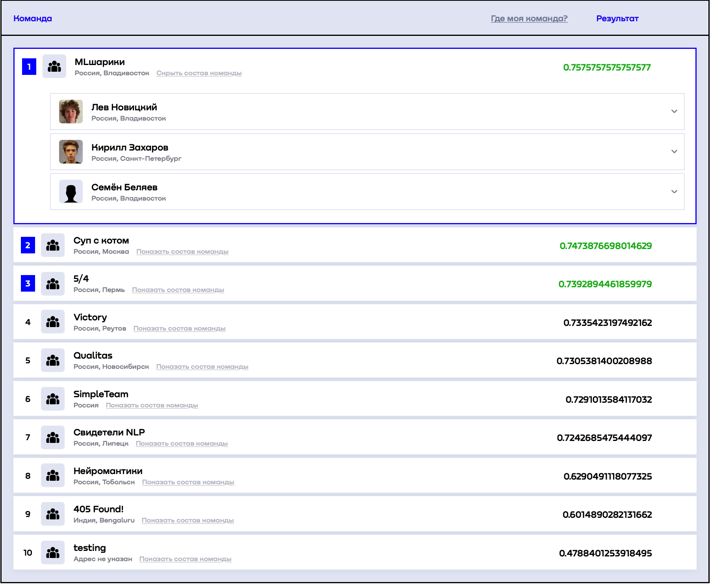

# AI-IJC
Our top 1 solution to [AI IJC](https://aiijc.com/en/about) competition </br></br>
</br></br>

Contest included several tasks:
1. Prediction aggressive driving among taxi drivers using following data types: taxi route, customer comment about the ride, other table data about the order.
2. Extracting a reason for aggressive driving from comments
3. Detecting parts of taxi routs with aggressive driving
4. Building a clustering system for taxi drivers, which in future could be used as a reward system

About the data:
* There were only two labels in the dataset: ```0``` which meant unaggressive driving and ```1```, which symbolized aggressive driving. The dataset was imbalanced with about 96% of ```0``` labels and only 4% of ```1```. These labels were only given for the first task. </br> 
* The dataset itself didn't have commnets for every ride, which made it hard to train big supervised models.</br>
However we had a whole dataset of unlabeled comments. Which we were to use.

Solution for the 1st task:</br>
1. The best score was achieved with a text model [sismetanin/xlm_roberta_base-ru-sentiment-rusentiment](https://huggingface.co/sismetanin/xlm_roberta_base-ru-sentiment-rusentiment). However the stack also included [XGBoost](https://xgboost.readthedocs.io/en/stable/#) with [Optuna](https://optuna.org) and a [GCN](https://pytorch-geometric.readthedocs.io/en/latest/modules/nn.html#torch_geometric.nn.conv.GCNConv)
2. We did EDA and cleaned short or senseless comments like "Да", "Нет", "." etc.
3. Implement UDA in order to utilize unlabeled samples. [Original PyTorch UDA implementation](https://github.com/SanghunYun/UDA_pytorch)
4. We used back translation to English as an augmentation of unlabeld data.
5. We chose [Cross Entropy](https://pytorch.org/docs/stable/generated/torch.nn.CrossEntropyLoss.html?highlight=cross%20entropy#torch.nn.CrossEntropyLoss) as supervised loss and [KL Divergece](https://pytorch.org/docs/stable/generated/torch.nn.KLDivLoss.html) as unsupervised loss

Solution for the 2nd task:</br>
1. Delete senseless samples from text dataset
2. Use a QA model [AlexKay/xlm-roberta-large-qa-multilingual-finedtuned-ru](https://huggingface.co/AlexKay/xlm-roberta-large-qa-multilingual-finedtuned-ru) by asking it ```"как выражалось агрессивное вождение?"```

Solution for 3rd task:
1. Training a [GCN](https://pytorch-geometric.readthedocs.io/en/latest/modules/nn.html#torch_geometric.nn.conv.GCNConv) model for the task 1
2. Using the model to score driving agressiveness at every node individually


